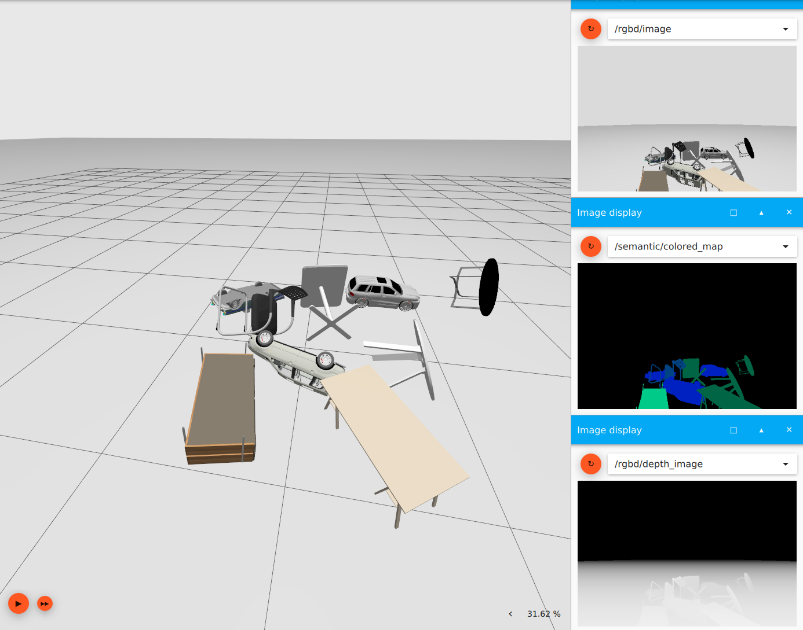

# Shapenet Simulator: A Simulator using Multiple Shapenet Model Objects with Semantic Rendering

An example of the simulator:

## Environmental Setup
For using the simulator, you need to install [docker](https://docs.docker.com/engine/install/) and [nvidia run time](https://github.com/NVIDIA/nvidia-container-toolkit) support.

```commandline
git clone git@github.com:liren-jin/shapenet_simulator.git
cd shapenet_simulator
docker build . -t shapenet-simulator:v0
```
## Generate a Scene
The simulator supports generation of random scenes. 

(optional) We use python to generate files that can be used for the simulator, e.g., launch and sdf files, use requirements.txt to install necessary python packages:
```commandline
conda create -n shapenet-simulator python==3.9
conda activate shapenet-simulator
pip install -r requirements.txt

```

(optional) For the first time or when new models are added into the repo, we generate individual model sdf:
```commandline
cd src/simulation
python model_sdf_generator.py
```

(optional) We also need a scene sdf file describing all scene properties:
```commandline
python scene_sdf_generator.py
```
For customizing scene properties, using simulator/cfg/scene_cfg.yaml.

To generate a new launch file to launch scene and models:
```commandline
python launch_file_generator.py -N <number of objects> -S <seed number>
```
Random seed -S together with object number -N specify a scene configuration. If you do not want to reproduce a scene configuratin, leave out -S flag. 


## Basic Usage
After you create a new simulation, you can run:
```commanline
xhost +local:docker
make 
make simulation
```

If everything goes well, you should see an Ignition-Gazebo user interface. It may take a few seconds untill all objects stay static (In case it crushes, just restart the simulation, it always helps). If you wish to save current scene for better reproducibility / future usage, in gazebo interface, click menu logo and save world to the src/simulator/scenes folder. 


To interact with the simulator in your own project, follow the topics and message types listed below: 

required topic:
- /set_camera_pose [geometry_msgs/Pose]

published topics:
- /rgbd/camera_info [sensor_msgs/CameraInfo]
- /rgbd/depth_image [sensor_msgs/Image]
- /rgbd/image [sensor_msgs/Image]
- /semantic/labels_map [sensor_msgs/Image]

## Save Current Scene and Reopen
To reopen a scene via saved world sdf file:
```commandline
xhost +local:docker
make
make enter
ign gazebo -r <scene_name>.sdf
```
You should see the same world you saved. If you want to run the simulator in a headless mode, use `ign gazebo -r -s headless-rendering <scene_name>.sdf` instead.

## Models
Shapenet model can be download from [here](https://shapenet.org/download/shapenetcore).
Select your models and copy them to src/simulator/models folder. Catogrize the models based on their semantic class (allowed category names are shown in constants.py file, you can customize your own model lists). An example would be :
```
src/simulator/models
|
|___ car
|    |__ model1
|    |__ model2
|    |__ ...
|
|__ airplane
|   |__ model1
|   |__ model2
|   |__ ...
|
|__ ...

```

## Data Generation
Our simulator can be used to generate data set for semantic segmentation training, in the conda environment:
```commandline
cd src/data_generator
python main.py -P <path pattern> -BG <budget number>
```
Currently, coverage, random and uniform path pattern are supported.


## Maintainer
Liren Jin, University of Bonn, ljin@uni-bonn.de